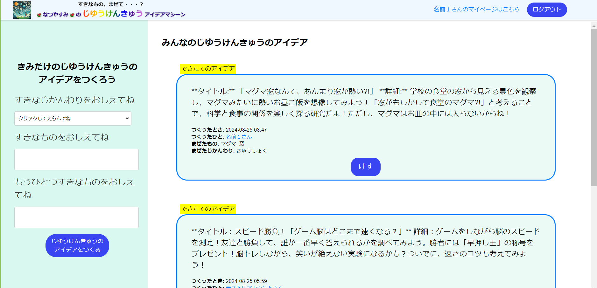

# アプリケーション名
すきなもの、まぜて・・・？なつやすみのじゆうけんきゅうアイデアマシーン

# アプリケーションの概要
このアプリは、主に小学校低学年の児童向けに、夏休みの自由研究アイデアを提案するWebアプリケーションです。  
ユーザーが興味を持つジャンル（教科）を選び、2つの任意の言葉を入力すると、AIが自由研究のアイデアを生成します。他のユーザーが生成した自由研究のアイデアも見ることができ、自分が思いつかなかったようなことにも興味が派生していくようにしています。  
子どもの自然な好奇心を刺激し、自発的に自由研究や日々の学習に取り組むきっかけを作ることを目指しています。

# URL
アプリケーションはAWS上にデプロイされています。以下のURLからアクセスできます。  
[](http://18.177.91.86:3000/)

# テスト用アカウント
- Basic認証パスワード：
- Basic認証ID：
- メールアドレス：@ttttt.com
- パスワード：

# 利用方法
1. トップページ（一覧ページ）のヘッダーから新規登録を行う


2. 画面左「きみだけのじゆうけんきゅうのアイデアをつくろう」の下にある「すきなじかんわりをおしえてね」のプルダウンから1つ教科を選び、「すきなものをおしえてね」と「もうひとつすきなものをおしえてね」の2箇所に任意の言葉を入力し、「じゆうけんきゅうのアイデアをつくる」ボタンをクリックする  


# アプリケーションを作成した背景
今年小学校にあがったばかりの息子が、初めての自由研究にとまどっていてなかなか取りかかることができなかったため。  
自由研究のアイデアを、子ども自身が興味のあることを出発点として楽しく見つけ、前向きな気持ちで取りかかれることを目指しました。  
人は、自分でやりたいと思ったことには積極的に取り組む一方で、他人から強要されると反発しがちです。自由研究はその自由さゆえに、何をすればよいのか分からずに戸惑ってしまうお子さんも少なくありません。  
そうしたことからこのアプリケーションは、子どもたちが自由研究のアイデアを自分の好きなものを１つのきっかけとして見つけられたらいいなと思っています。  
「知ることの面白さ」を知り、「もっと学んでみよう」という心を大切にしたいと思っています。自分の興味や関心を学習のきっかけにして、次の知的好奇心に繋げることで学習の効果が高まり、長期的な成長にもつながることを信じています。

## 工夫したポイント
- ユーザーが直感的に操作できるように、シンプルなUI設計にしました。  
- アプリの使い勝手を向上させるために、できるだけページ遷移がない構成にしました。
- OpenAIのAPIを利用して柔軟なアイデア生成ができるようにしました。AIが第三者的な役割を果たすことで、親が言うよりも子どもの心に自然に入り込むようなアプローチを目指しました。

## 苦労した個所
OpenAIのAPIを使用してアイデア生成を行う際にAPI連携がうまくいかず、機能実装までに時間がかかりました。
OpenAIやGithubの公式ドキュメントを参考にしてリクエストとレスポンスの形式の設定や環境変数の設定などを見直して試行錯誤を繰り返した結果、完成させることができました。

## このアプリケーションを実際に使用した結果
開発段階から我が子にも実際に使用させ、いくつもの自由研究のアイデアを出しては親子で楽しく会話をしながらアイデアをさらに広げていきました。  
その結果、小学校初めての自由研究は「ビスケットは何回たたくと1億個になるか」をテーマに子どもなりに考えてまとめ、無事完成させました。算数が得意な子どもは最後まで楽しく取り組めたようでよかったです。自ら学びたいと思えることを見つけるのが最も重要だと考えているので、そのきっかけになるようにしたいです。  
  
今後も少しずつ追加実装をしていき、冬休みの自由研究のときにはさらに改善したアプリケーションにしているつもりです。

# 実装した機能
- **ユーザー登録機能**: ユーザーがアカウントを作成し、ログインできる機能。
- **自由研究のアイデア生成機能**: ユーザーが選んだ教科と、入力した2つの任意の言葉を元にAIが自由研究のアイデアを生成する機能。
- **自由研究のアイデアの一覧表示機能**: 生成された自由研究のアイデアを表示する機能。
- **自由研究のアイデアのユーザーごとの一覧表示機能**: 生成された自由研究のアイデアをユーザーごとに表示する機能。
- **削除機能**: ユーザーが生成した自由研究のアイデアを削除する機能。
- **新着順表示機能**: 新しい投稿から順に表示されるように、新着順（降順）に表示される機能。
- **新着表示機能**: 24時間以内の投稿には「NEW」表示が付く機能。

### 画面イメージ


# 実装予定の機能
- **コメント機能**: 他のユーザーから「そのアイデアおもしろそうだね」「○○を入れてみるともっとおもしろくなりそうだね」などとフィードバックを得られることで、アイデアをさらに具体化するきっかけになります。
- **いいね機能**: 気に入ったアイデアに「いいね」を押すことで、ユーザー間で人気のアイデアが可視化され、投稿者のモチベーションを高めます。
- **検索機能**: キーワードやカテゴリを使って自由研究のアイデアを検索できる機能を追加し、ユーザーが自分の興味に合ったアイデアを見つけやすくします。

# テーブル設計

## users テーブル

| Column             | Type   | Options     |
| ------------------ | ------ | ----------- |
| nickname           | string | null: false |
| email              | string | null: false, unique: true |
| encrypted_password | string | null: false |

### Association

- has_many :jokes
- has_many :ai_jokes


## jokes テーブル

| Column | Type   | Options     |
| ------ | ------ | ----------- |
| user       | references| null: false, foreign_key: true |
| category_id   | integer   | null: false |
| input_text1   | string    | null: false |
| input_text2   | string    | null: false |


### Association

- belongs_to :user
- belongs_to_active_hash :category
- has_one :ai_joke


## ai_jokes テーブル

| Column | Type       | Options                        |
| ------ | ---------- | ------------------------------ |
| user   | references | null: false, foreign_key: true |
| joke   | references | null: false, foreign_key: true |
| ai_joke| text      | null: false |

### Association

- belongs_to :user
- belongs_to :joke


# ER図

以下のER図は、当アプリケーションのデータベース構造を表しています。


- **usersテーブル**: アプリケーションのユーザー情報を管理します。ユーザーのニックネーム、メールアドレス、暗号化されたパスワードが含まれます。各ユーザーは複数のjoke（自由研究のアイデアのもと）とAIjoke（生成された自由研究のアイデア）を持つことができます。ユーザーは必ずしもjoke（自由研究のアイデアのもと）とAIjoke（生成された自由研究のアイデア）を持つ必要はなく、閲覧のみを行うユーザーも存在します。このため、ユーザーとjoke（自由研究のアイデアのもと）とAIjoke（生成された自由研究のアイデア）のリレーションシップは「1対0多」となります。

- **jokesテーブル**: ユーザーが入力したjoke（自由研究のアイデアのもと）のデータを格納します。joke（自由研究のアイデアのもと）は、ユーザーIDを外部キーとしてユーザーと関連付けられており、カテゴリIDと二つの入力テキストフィールドを持っています。各joke（自由研究のアイデアのもと）は一つのAIjoke（生成された自由研究のアイデア）を持つことができます。

- **ai_jokesテーブル**: AIによって生成されたAIjoke（生成された自由研究のアイデア）を保存します。このテーブルは、AIjoke（生成された自由研究のアイデア）がユーザーに関連付けられた状態で、生成されたAIjoke（生成された自由研究のアイデア）の内容を保持します。`user_id`および`joke_id`は、それぞれ`users`テーブルおよび`jokes`テーブルへの外部キーです。

各テーブルは、外部キーを介して他のテーブルと連携し、アプリケーション内のデータの整合性と一貫性を確保しています。
## 開発環境

| 項目                   | 使用技術                                      |
| ---------------------- | --------------------------------------------- |
| フロントエンド         | HTML, CSS                                     |
| バックエンド           | Ruby on Rails 7                               |
| データベース           | MySQL (RDS: MariaDB)                          |
| データベース管理       | DBeaver                                       |
| インフラ               | AWS (EC2, RDS)                                |
| OS                    | Windows 11                                    |
| バージョン管理         | GitHub                                        |
| エディタ               | Visual Studio Code (VSCode), Vim              |
| ターミナル/シェル      | PowerShell 7, コマンドプロンプト, AWS CloudShell |
| クラウドサービス管理   | AWS CLI (Amazon Web Services Command Line Interface) |
| API                   | openAI API                                    |
| Linux環境             | Ubuntu (WSL - Windows Subsystem for Linux)    |

### 技術選定について
- **Rails**: 「設定より規約」(Convention over Configuration)の原則を採用し、効率的に開発を進めました。

# ローカルでの動作方法

1. リポジトリをクローンします。
```bash
git clone https://github.com/Tomogit2/original_app1
```
2. 必要なGemをインストールします。
```bash
bundle install
```
3. データベースを作成します。
```bash
rails db:create db:migrate
```
4. 環境変数を設定します。
```bash
export OPENAI_API_KEY=your_api_key
```
※ 別途、OpenAIでAPI Keyを取得し、OPENAI_API_KEYとして環境変数に設定する必要があります。APIキーはOpenAIプラットフォーム（https://platform.openai.com/docs/overview ）から取得できます。ログイン後、上部メニューから「Dashboard」に移動し、左のメニューから「API keys」を選択してAPIキーを作成してください。  
5. サーバーを起動します。
```bash
rails server
```
6. ブラウザで`http://localhost:3000`にアクセスし、アプリケーションが動作していることを確認します。